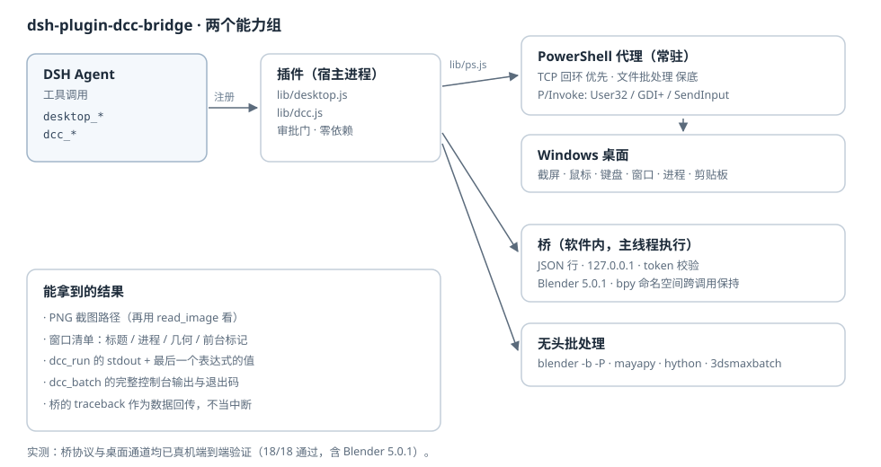

此插件适用于DeepSeek Harness
# dsh-plugin-dcc-bridge

给 DSH 加两件事：

1. **控制电脑** —— 截图、鼠标、键盘、窗口、进程、剪贴板，直接操作真实的 Windows 桌面。
2. **接入 3D 软件** —— 发现已安装的 3D 软件、带桥启动、在**正在运行的**软件里执行 Python 并拿回结果，或者用无头批处理跑脚本。

Blender 是完整适配的（真机验证过 5.0.1）；Maya、3ds Max、Houdini、Cinema 4D、Unreal、Unity、Godot、SketchUp、Rhino 有自动探测和无头批处理配方，GUI 内桥接适配层可照 Blender 的写法补。



**零依赖**：整个插件只用 Node 内置模块，不 import 任何 `@deepseek-ai/*`，也不需要编译。

---

## 安装

三种装法，任选其一（都是 DSH 自带的插件管理能力，不用改 DSH 源码）：

1. **Web 侧边栏 → Plugins 页面**：填包名或本地目录路径。
2. **让 agent 装**：调用 `plugin_manager` 工具，`action: install_bundle`，`target` 给 npm 包名或本地绝对路径。该工具需要 `danger-full-access` 或逐次审批，在 Creator 模式默认可用。
3. **CLI**：`dsh plugin …`（子命令以 `dsh plugin --help` 为准）。

用本地目录路径安装会以 `link:` 方式挂进去，改代码不用重装。

> **改完源码必须重启 DSH。** 宿主插件**不会**热加载——Node 的 ESM 模块缓存按 URL 生效，实测「禁用再启用」和「卸载再安装」都不足以让新代码进入运行中的进程。这条坑我踩过，写在 [已知限制](#已知限制) 里了。

装好后 `dcc_list`、`desktop_*` 这些工具会出现在 agent 的工具表里。

---

## 工具

### 电脑控制

| 工具 | 作用 |
| --- | --- |
| `desktop_screenshot` | 截整个虚拟桌面 / 单个显示器 / **某个窗口**（被遮挡也能截）/ 指定像素区域，存成 PNG 并返回路径 |
| `desktop_mouse` | 读光标位置、移动、单击 / 双击 / 右键 / 中键、**拖拽**（带插值，3D 视口和滑杆才认）、滚轮 |
| `desktop_keyboard` | 输入任意文本（走 `KEYEVENTF_UNICODE`，中文也能打）、按单个键、按组合键 |
| `desktop_window` | 列出顶层窗口（标题 / 进程 / 几何 / 谁在前台），聚焦、最小化、最大化、还原、隐藏、关闭、移动缩放 |
| `desktop_process` | 列出进程、启动程序、结束进程 |
| `desktop_clipboard` | 读 / 写 / 清空文本剪贴板 |

### 3D 软件

| 工具 | 作用 |
| --- | --- |
| `dcc_list` | 报告哪些 3D 软件装了（路径、来源）、哪些有活着的桥。**先调它** |
| `dcc_launch` | 启动软件；`bridge: true`（默认）会把桥一起挂上，等桥应答后返回端口 |
| `dcc_run` | 在**已打开**的软件里执行 Python，返回 stdout 和最后一个表达式的值；命名空间跨调用保持 |
| `dcc_batch` | 无头批处理：用软件自带的批处理入口或脚本解释器（`blender -b -P`、`mayapy`、`hython`、`3dsmaxbatch`…）跑脚本并回收完整控制台输出 |
| `dcc_bridge_install` | 把桥装成软件内的插件，这样**你手动打开的**那个会话也能被 `dcc_run` 接管 |

---

## 上手

### 1. 控制电脑

装好就能用。第一次做**会改变机器状态**的动作（动鼠标、敲键盘、写剪贴板、启动/结束进程、动窗口）时，会先弹一次确认；同意后本次会话内同类动作不再重复问。

关掉确认（比如让它无人值守跑）：

```yaml
# ~/.dsh/profiles/desktop/cordis.patch.yml
- insert:
    - id: dcc-bridge
      name: dsh-plugin-dcc-bridge
      config:
        inputApproval: never   # never | session | always
```

只读动作（截图、列窗口、读剪贴板、查进程、读光标）任何时候都不问。

### 2. 接 Blender

**路线 A —— 让 DSH 把 Blender 带桥拉起来（最省事）**

```
dcc_launch { app: "blender", bridge: true }
→ Bridge live on 127.0.0.1:47810

dcc_run { app: "blender", code: "import bpy\nbpy.ops.mesh.primitive_cube_add()\nprint(len(bpy.data.objects))" }
```

想让 Blender 不弹窗口（服务器、批处理场景），把 `-b` 当调用方参数传进去：

```
dcc_launch { app: "blender", bridge: true, extraArgs: ["-b"] }
```

**路线 B —— 接管你自己已经开着的 Blender**

1. `dcc_bridge_install { app: "blender" }` 把桥拷进用户 `scripts/addons`。
2. Blender 里 `编辑 ▸ 偏好设置 ▸ 附加组件`，搜 "DSH" 打开。
3. 3D 视图侧边栏 `N` 键 → `DSH` 面板能看到监听状态。
4. `dcc_list` 里就会出现活着的桥，直接 `dcc_run`。

不想装插件也行，启动时带一段脚本即可：

```powershell
blender --python "<插件目录>\assets\blender_dsh_bridge.py" -- --port 47810
```

### 3. 无头批处理

不需要开软件、不需要桥：

```
dcc_batch {
  app: "blender",
  code: "import bpy\nprint(bpy.app.version_string)\nprint([o.name for o in bpy.data.objects])"
}
```

---

## 典型玩法

- **截图 → 看图 → 再动手**：`desktop_screenshot` 拿到路径，用 `read_image` 看，然后 `desktop_mouse` / `desktop_keyboard` 操作。截图不会自动喂给模型，得显式看一眼。
- **驱动没有脚本接口的软件**：`desktop_window { action: "focus", match: "Photoshop" }` → `desktop_keyboard { action: "hotkey", keys: ["ctrl","shift","s"] }`。
- **在活着的 Blender 里迭代建场景**：`dcc_run` 的命名空间是持续的，可以先建材质再赋给物体，分几步来。
- **批量出图 / 转格式**：`dcc_batch` 跑一个脚本，或者直接用 `script` 指向已有脚本文件。
- **混合**：能脚本就脚本（`dcc_run` 快且精确），脚本够不着的地方才动鼠标键盘。

---

## 安全

这个插件确实能操作你的电脑，几点说清楚：

- **审批门**：改状态的动作**每个会话每个工具第一次**会先问一次（`move` / `click` / `drag` / `scroll` / 键盘 / 写剪贴板 / 启动或结束进程 / 动窗口），同意后本会话内同类动作不再问。只读动作（截图、列窗口、读剪贴板、查进程、读光标）任何时候都不问。
  - `inputApproval` 可选 `never`（完全不等确认）/ `session`（默认）/ `always`（每次都问）。
  - 没有应答者时按 **失败关闭** 处理：动作会被拒绝，而不是偷偷执行。
  - 两种情形下门不会介入，这是设计而非遗漏：**调用方没有 agent**（脚本、自检），或者**这个组合里没有挂载审批服务**——后一种情形宁可放行也不能让工具整个不可用。
- **桥只绑 127.0.0.1**，并且每个请求要带启动时随机生成的 token；token 存在只有当前用户能读的发现文件里。带错 token 的连接会被拒绝（自检里有这一条）。
- **`dcc_run` 里的代码就是你给的代码**，以你的身份在这个软件里跑——和在该软件里手敲 Python 等价。它只受软件自身权限约束。
- **结束进程**（`desktop_process kill`）是不可逆的，别拿它试手。
- 插件不联网。桥是本机回环 TCP，桌面通道是本机回环 TCP 或本地文件。

### 改了源码之后

宿主插件**不会**热加载。Node 的 ESM 模块缓存按 URL 生效，实测「禁用再启用」和「卸载再安装」都不足以让新代码进入运行中的进程——**只有重启 DSH**。改完代码别只看工具还在不在，要看行为有没有变。

---

## 实现要点（给要改代码的人）

### 为什么桌面通道有两套传输

在受限父进程下，`child_process.spawn` 用默认 `stdio: 'pipe'` 会 **EPERM**——Windows 上建匿名管道被拒。所以：

- **首选 TCP**：PowerShell 代理先编译好 P/Invoke 层，然后在 127.0.0.1 上监听，Node 连过去，请求按 JSON 行收发。一次进程常驻整个会话，编译只付一次。
- **保底文件**：`-Request <in> -Response <out>` 一次性调用，只用文件，`stdio: 'ignore'`。永远能用，但每次都要重编译。

首次调用自动选路并记住。实测：首次约 7 秒（PowerShell 启动 + 编译 C#），之后 **2–200ms**。

捕获子进程输出（`dcc_batch`）同理走**文件描述符重定向**而不是管道：

```js
const out = openSync(outPath, 'a');
spawn(exe, args, { stdio: ['ignore', out, errFd] });
```

### 为什么桥要在主线程泵

`bpy` 不是线程安全的。桥的 TCP 线程只负责收包，把请求塞进队列，由**主线程**执行：

- GUI：`bpy.app.timers.register(pump, persistent=True)`
- 后台模式（`-b`）：没有事件循环，`--python` 脚本自己起循环驱动泵
- `--standalone`：纯 CPython 下跑同一套协议，方便不开 Blender 也能测桥

顺带一个坑：一开始给客户端 socket 设了 1 秒超时，结果 `makefile().readline()` 空闲 1 秒就抛异常、连接被服务端丢掉。现在改成**不带超时的阻塞读 + 独立看门狗线程**处理空闲退出。

### 发现目录为什么是多个

`%LOCALAPPDATA%`、`%APPDATA%`、`%TEMP%`、`~/.dsh/dcc-bridge` 都写一遍，读取方全扫一遍。原因：手动启动的软件和 DSH 拉起的软件 `TEMP` 可能不同，受限进程还可能被拒写其中一个。设 `DSH_DCC_BRIDGE_DIR` 可以覆盖成单一目录。

桥**监听成功之后**才写发现文件，所以连不上的发现文件必然属于已死的进程——`dcc_list` 会顺手删掉它们（Blender 的 `quit_blender` 是直接终止进程，来不及自己清理）。

### 为什么没有一行 `@deepseek-ai/*` 导入

插件住在 profile 里，那里**解析不到**应用自带的 `@deepseek-ai/*` 包。所以工具定义直接用注册表要的原始形态写（`{ name, description, parameters, output: { schema, render }, execute }`），不经过 `defineTool`。整个插件只用 Node 内置模块。

### 3D 软件是怎么被找到的

不依赖安装注册表（Blender 装在 F: 盘、还是便携版，注册表里什么都没有）。策略是按目录布局做**受限通配展开**：

```js
{ roots: ['programFiles'], segments: ['Blender Foundation', 'Blender *', 'blender.exe'] }
```

每个盘符 × 每个已知布局，只展开含 `*` 的那一层，不做全盘递归。另外还查 `PATH`、`%DSH_DCC_<APP>_PATH%` 环境变量和调用方显式给的 `path`。

---

## 已知限制

- **桌面控制仅 Windows**。非 Windows 上不注册 `desktop_*`，`dcc_*` 照常可用。
- **进程可见性取决于 DSH 宿主进程的权限**。如果宿主跑在受限令牌下，`desktop_process list` 只看得到一部分进程——这是权限事实，不是 bug。窗口标题里的进程名同理可能是空的。
- **GUI 版 Blender 的 `bpy.ops`** 在定时器回调里执行，部分操作符需要上下文覆盖；必要时在 `dcc_run` 的代码里自己传 `context.temp_override(...)`。
- **`dcc_launch` 只做了 Blender 的桥适配**。其他软件的桥需要照 `assets/blender_dsh_bridge.py` 写一个同协议的适配层（发现文件 + JSON 行 + 主线程执行），放进目录项 `bridge` 字段即可。
- **`dcc_run` 的 `exec` 模式不返回最后一个表达式的值**（`exec` 语义如此）；要值就用 `mode: "eval"`。
- **宿主插件源码不会热加载**，改完要重启 DSH（详见上面「改了源码之后」）。

---

## 自检

```powershell
node tools/selfcheck.mjs    # 端到端：桌面 + 3D 软件 + 桥协议
node tools/gate-test.mjs    # 审批门：18 项确定性断言
```

`selfcheck` 会真跑：桌面截图（整屏 + 单窗口）、窗口枚举、光标读取、进程枚举、剪贴板；DCC 探测；桥协议的完整往返（stdout、状态保持、eval、traceback 回传、错 token 拒绝、ping）；检出 Blender 时还会跑真机 `dcc_batch`、`dcc_launch`、`dcc_run`。

最近一次（本机装了 Blender 5.0.1）：

```
selfcheck  18 passed, 0 failed, 0 skipped
gate-test  18 passed, 0 failed
```

`gate-test` 用一个模拟 Context 驱动 `apply()`，记录每一次审批请求，覆盖：只读动作不问、改状态动作问一次并记住本会话、换会话重问、拒绝即中断且不执行动作体、没有应答者时失败关闭、无 agent 的调用者不问、`never` / `always` 两种模式、以及只靠 `ctx.inject` 也能拿到审批服务。

---

## 目录

```
lib/
  index.js     插件入口：注册工具、审批门、资源生命周期
  ps.js        PowerShell 代理的传输层（TCP 常驻 / 文件保底）
  desktop.js   6 个桌面控制工具的定义
  dcc.js       3D 软件目录、探测、桥客户端、5 个 dcc_* 工具
  proc.js      子进程捕获（文件描述符重定向，不用管道）
  tool.js      工具定义与渲染的小工具
assets/
  desktop-agent.ps1      常驻 PowerShell 代理（JSON 行协议 + P/Invoke）
  blender_dsh_bridge.py  Blender 桥（同时是 addon 和 bootstrap）
tools/
  selfcheck.mjs          端到端自检（桌面 + 3D + 桥协议）
  gate-test.mjs          审批门的确定性单元测试
  probe_blender.py       纯 Python 的桥协议探针
```

## 配置项

```yaml
- insert:
    - id: dcc-bridge
      name: dsh-plugin-dcc-bridge
      config:
        enableDesktop: true       # 关掉就不注册 desktop_*
        enableDcc: true           # 关掉就不注册 dcc_*
        inputApproval: session    # never | session | always
        dccApps: []               # 只暴露部分目录项，如 [blender, houdini]
        extraPaths:               # 探测不到时手工钉住可执行文件
          blender: "F:\\Program Files\\Blender Foundation\\Blender 5.0\\blender.exe"
```

---

## 参与开发

插件零依赖，不需要构建步骤：改完 `lib/` 里的文件直接重启 DSH 就能看到效果。

```bash
node tools/selfcheck.mjs --definitions-only   # 只查工具 schema（任何平台都能跑）
node tools/selfcheck.mjs                      # 端到端：桌面 + 3D 软件 + 桥协议
node tools/gate-test.mjs                      # 审批门单元测试（需要 Windows）
```

`selfcheck` 里检测不到的东西会报 **SKIP** 而不是假装通过——没装 Blender、没接显示器、非 Windows，它都会如实说，所以它同时也能当 CI 步骤用。

CI（`.github/workflows/ci.yml`）跑两组：Linux 上做语法检查 + 工具 schema 校验 + 发布清单校验；Windows 上跑审批门测试。

想加新的 3D 软件适配？在 `lib/dcc.js` 顶部的 `DCC_APPS` 里加一条目录项（可执行文件名、安装目录布局、批处理参数），GUI 内桥接则照 `assets/blender_dsh_bridge.py` 写一个同协议的适配层——协议很小：读发现文件 → 连回环 TCP → 发 JSON 行 → 在软件主线程执行 → 回写结果。

## 安全

这个插件能操作你的电脑。能力边界、已有的控制手段、以及建议的使用姿势，都写在 [SECURITY.md](SECURITY.md) 里，装之前值得看一眼。

## 许可证

[MIT](LICENSE)。随便用，保留版权声明即可。

---

## 致谢与来源

这个插件是在一次真实的 DSH 会话里写出来并当场验证的：桌面通道、桥协议、以及真机 Blender 5.0.1 的端到端往返都在目标机器上跑过。文档里所有「实测」字样都对应一次真实运行，没有从文档推演出来的结论。
